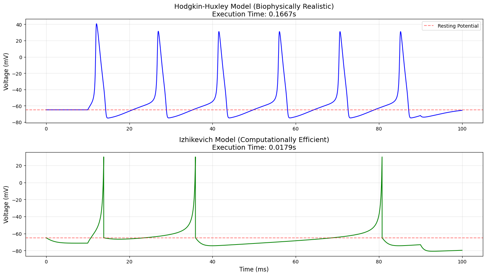
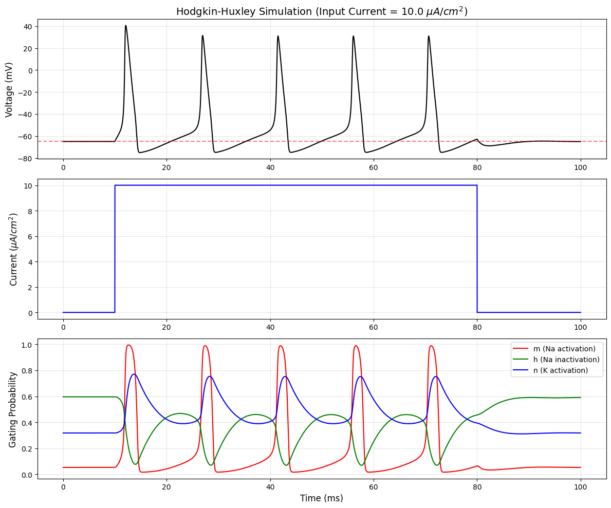

# High-Fidelity Neural Spike Prediction: Hodgkin-Huxley vs. Izhikevich Models

[](https://opensource.org/licenses/MIT)
[](https://www.python.org/downloads/)
[]()

> A rigorous computational analysis evaluating the accuracy-cost trade-off between biophysical and phenomenological neural models, designed for applications in Brain-Computer Interfaces (BCI) and large-scale neuromorphic hardware.

## 📑 Table of Contents
- [Abstract](#abstract)
- [Background & Motivation](#background--motivation)
- [The Models](#the-models)
- [Key Findings & Results](#key-findings--results)
- [Visualizations](#visualizations)
- [Repository Structure](#repository-structure)
- [Installation & Usage](#installation--usage)
- [Dependencies](#dependencies)
- [Authors](#authors)
- [License](#license)

## 🔬 Abstract
The development of advanced Brain-Computer Interfaces (BCIs) and neuromorphic chips requires a delicate balance between biological realism and computational efficiency. This repository contains the simulation codebase and analytical report comparing the biophysically detailed **Hodgkin-Huxley (HH) model** (1952) with the computationally optimized **Izhikevich model** (2003). By simulating both architectures under identical step-current stimuli, we quantify performance across computational latency, action potential morphology, and dynamical excitability. 

## 🧠 Background & Motivation
In computational neuroscience, modeling the precise firing of neurons is foundational for decoding motor intents and understanding network dynamics. 
* The **Hodgkin-Huxley model** remains the gold standard for cellular-level physiological analysis, capturing complex intracellular ion channel kinetics.
* The **Izhikevich model** offers a phenomenological approach, reducing the 4-dimensional nonlinear ODE system of the HH model into a highly efficient 2-dimensional system.

This project identifies the optimal use cases for each model, specifically targeting the computational bottlenecks faced by next-generation neurotechnology arrays.

## ⚙️ The Models
1. **Hodgkin-Huxley (Biophysical):** Solves 4 coupled nonlinear ordinary differential equations tracking membrane potential ($V$), sodium activation ($m$), sodium inactivation ($h$), and potassium activation ($n$).
2. **Izhikevich (Phenomenological):** Solves 2 simplified ordinary differential equations tracking membrane potential ($v$) and a recovery variable ($u$), combined with a discrete mathematical reset mechanism to simulate spike peaks.

## 📊 Key Findings & Results
Our experimental simulations (conducted over a 100ms duration with a 0.01ms timestep) yielded the following benchmarks:

| Metric | Hodgkin-Huxley | Izhikevich |
| :--- | :--- | :--- |
| **Execution Time** | ~0.1580s | ~0.0194s |
| **Relative Speed** | 1.0x (Baseline) | **~8.2x Faster** |
| **Equations Solved** | 4 Coupled ODEs | 2 Simple ODEs + Reset |
| **AP Morphology** | High accuracy (includes AHP) | Approximate (sharp reset) |
| **Excitability** | Type II | Tunable (Type I or II) |

**Conclusion:** The Izhikevich architecture is strictly superior for real-time, large-scale hardware implementations, while the HH model remains indispensable for targeted biophysical and pharmacological research.

## 📈 Visualizations

### 1. Waveform & Execution Comparison
*(Showcases the morphological differences between the smooth biological curve of the HH model and the computationally efficient hard-resets of the Izhikevich model.)*

<p align="center">
  
</p>

### 2. Ion Channel Gating Dynamics (Hodgkin-Huxley)
*(Demonstrates the precise opening and closing probabilities of the m, n, and h gates in response to the injected step current.)*

<p align="center">
  
</p>

## 📁 Repository Structure
```
neural-model-comparison/
│
├── src/                      # Source code
│   ├── hh_simulation.py      # Standalone Hodgkin-Huxley implementation
│   ├── iz_simulation.py      # Standalone Izhikevich implementation
│   └── comparative_runner.py # Unified script for timing and side-by-side plotting
│
├── docs/                     # Documentation and reports
│   └── final_report.pdf      # Full research paper
│
├── images/                   # Generated plots and diagrams
│   ├── comparative_spike_plot.png
│   └── gating_variables_plot.png
│
├── requirements.txt          # Python dependencies
└── README.md                 # Project overview
```

## 🚀 Installation & Usage

1. **Clone the repository:**
   ```
   git clone https://github.com/dearabhin/neural-model-comparison.git
   cd neural-model-comparison
   ```

2. **Install dependencies:**
   ```bash
   pip install -r requirements.txt
   ```

3. **Run the comparative simulation:**
   ```bash
   python src/comparative_runner.py
   ```
   *This will execute both models, print the relative speedup to the console, and generate the comparative plots.*

## 📦 Dependencies
* `numpy` >= 1.21.0
* `matplotlib` >= 3.4.0

## 👨‍💻 Authors
* **Abhin Krishna** - *Simulation Architecture & Dynamical Analysis*
* **E A Muhammed Aadil** - *Implementation & Benchmarking*

*Department of Electronics and Biomedical Engineering* *Model Engineering College, Thrikkakara*

## 📄 License
This project is licensed under the MIT License - see the [LICENSE](LICENSE) file for details.
